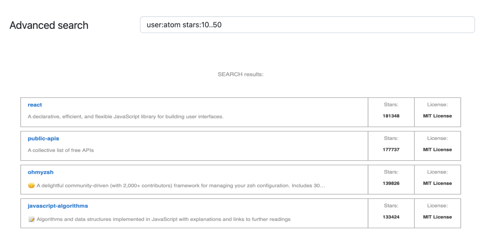

# Requirements

Build a simple github repo search app. Refer to this [GitHub documentation](https://docs.github.com/en/search-github/searching-on-github/searching-for-repositories) for details on different qualifiers with examples. Refer to [this documentation](https://docs.github.com/en/search-github/getting-started-with-searching-on-github/understanding-the-search-syntax) for appropriate syntax.

You should be able to search for repositories on GitHub and narrow the results by the following 2 repository search qualifiers from the above documentation (_ignore other search qualifiers from the documentation and any other search terms not listed_), in any combination:

1. Search in all repositories owned by a certain user

   _and/or_

2. Search by number of stars

## Other Requirements

1. Search on <kbd>Space</kbd> key press or on <kbd>Enter</kbd>
2. Cache each search term and results until next page reload
3. Search results will be displayed below the input field. (_No need to include sorting/pagination_)

## Extra Credit (optional)

- Add 4 basic user input validation rules of your choice with helpful error messages
  - e.g., The following qualifier syntax: “stars:10:50” is not supported. Try formatting as “stars:10..50” in order to search for repositories with between 10 and 50 stars.
- Add unit tests for your validation rules.
- Persist results on refresh
- Add ‘search’ query param into page url to support bookmarking search term results

## One Page Design

## Deliverables

Please package your submission up into a zip file. _Do not include node_modules folders in the zip._ We should be able to unzip your submission and run it via **npm or yarn (or whatever you specify).**

Please feel free to reach out to us with any questions.

## Clarifying Questions Asked

1. In the second paragraph about search qualifiers, it says "ignore other search qualifiers from the documentation and any other search terms not listed”.

   a. Question: Does this mean that generic queries with no qualifiers should be ignored/invalid? (e.g., Simply “atom” vs. “user:atom”)

2. Under “Extra Credit”, the last bullet says "Add ‘search’ query param…"

   a. Question: Does this param need to be explicitly named ’search’?

### Answer

1. Correct, you should ignore any generic queries without qualifiers (apologies if this is unclear in the instructions)
2. Nope, you can name it something else if you prefer. I would recommend keeping it simple.
